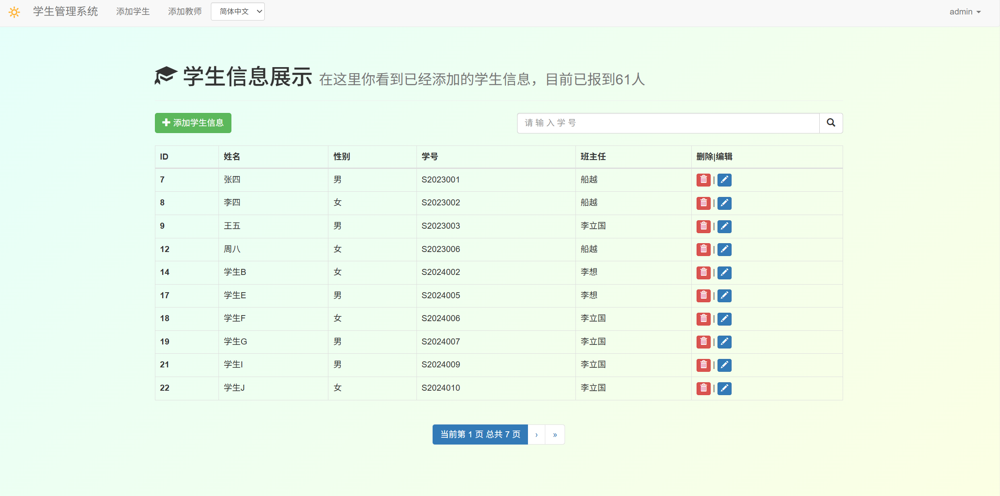
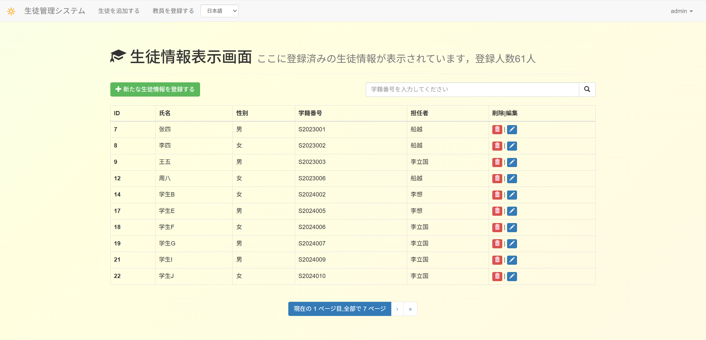

# 基于Django的学生信息管理
一个功能完整的双语（简体中文/日本語）学生管理系统，专注于展示 **Django 国际化 (i18n) 与本地化 (l10n)** 的最佳实践与完整实现流程。

🌐 **在线演示 (Live Demo):**: [(已上线)点击此处访问部署在 PythonAnywhere 上的应用](https://sakuracn.pythonanywhere.com)

------

##  项目特色

- **核心焦点**: 并非一个功能繁杂的业务系统，而是一个**技术展示项目 (Showcase Project)**，演示 Django i18n/l10n实现 。
- **无缝语言切换**: 实现了前后端完全国际化，支持简体中文与日本語之间的即时、无缝切换。
- **标准技术栈**: 使用 Django 全栈开发，包含模型设计、表单验证、视图逻辑、模板渲染及用户认证。
- **响应式界面**: 基于 Bootstrap 3 构建，适配桌面与移动设备。
- **开箱即用**: 结构清晰，代码注释完整。

## 🛠️ 技术栈

- **后端框架**: [Django](https://www.djangoproject.com/)
- **前端框架**: [Bootstrap 3](https://getbootstrap.com/docs/3.3/)
- **数据库**:  MySQL (生产)
- **国际化**: Django i18n & l10n
- **部署平台**: PythonAnywhere

##  项目截图

| 中文界面                                 | 日文界面                                  |
| :--------------------------------------- | :---------------------------------------- |
|  |  |
| *学生列表页（中文）*                     | *学生列表页（日本語）*                    |


### 🔧 生成翻译文件（供开发者参考）

本项目翻译文件已编译完成。如需添加新翻译或修改，请遵循以下步骤：

bash

```python
# 1. 在代码和模板中标记新字符串（使用 _() 和 ）
# 2. 生成消息文件
django-admin makemessages -l ja  # 生成日文
# django-admin makemessages -l zh_Hans  # 如需生成中文
# 3. 编辑 locale/ja/LC_MESSAGES/django.po 文件，填写 msgstr
# 4. 编译消息文件
django-admin compilemessages
```

## 👨‍💻 作者

**一个过劳的普通本科在校生**

- GitHub: [@CN_Sakura]
- 邮箱: xiao_fei_xiang@qq.com
- 技能: Python / Django / 日本語 (N2)/Web Crawling(request/xpath/)/……


